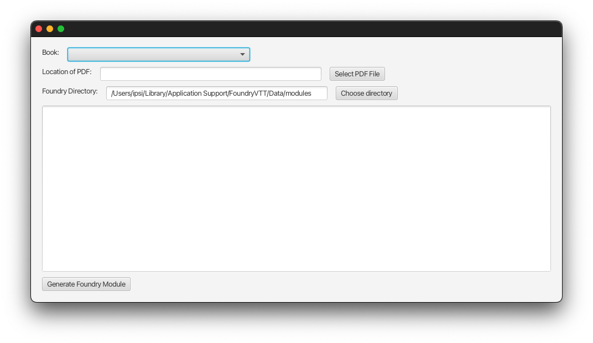

# VTT World of Darkness Book Parser
This is a desktop application for Windows, macOS and Linux which reads PDF files for supported White Wolf / Onxy Path
books (see [Supported Books](#supported-books)), extracts a subset of the text and images from the PDF, and converts that
subset into a [Foundry VTT](https://foundryvtt.com) module.

## Supported Books
Currently only [Werewolf: the Apocalypse 20th Anniversary Edition](https://www.drivethrurpg.com/product/112871/Werewolf-The-Apocalypse-20th-Anniversary-Edition?term=Werewolf+the+apocalypse+20) is supported.

## Content Generated
All content should be correctly de-hyphenated but if you notice any issues please let me know.

### Werewolf 20th
The following content is currently extracted from the PDF:

* Gifts (all tribes, except for Boli Zousizhe, Kucha Ekundu, Hakken, Siberakh, and Gifts of the Outsiders);
  Includes description + system, and gifts _should_ have the correct roll set, if applicable.
* Breed descriptions
* Auspice descriptions
* Tribe descriptions
* Backgrounds, including full description
* Rites, including full description
* Melee Weapons
* Fetishes & Talens

Things I would like to do (in rough priority order):

* Remaining items like ranged weapons and armor
* Spirit Charms
* Sample NPCs (e.g., Banes, Elementals, Weaver Spirits, etc)
* Merits & Flaws
* Totems
* Fomori powers
* Nature & Demeanor
* Tribal Camps
* Anything else that could be useful

## Getting started
Download the [latest release](https://github.com/ipsi/vtt-wod-book-parser/releases) for your operating system:

* macOS
* Linux
* Windows - note that two files are provided, one is an MSI installer, the other is the plain
  exe file.

When you run the application you will see a screen that looks like this (macOS version show):

### PDF File Location
Either type (or paste) the path of the PDF file for the book you want to use, or click the "Select PDF File" button and
choose the file.

### Foundry Directory
This will default to the [standard Foundry install location](https://foundryvtt.com/article/configuration/)
(on Linux, this will look in order and will pick the first directory that exists. If none exist, it will default to the first),
and will automatically create a module inside it. If you want to place the module in a different
directory, click the button next to the text box.

## Generating the Module
Once you've selected a book and entered your key, hit the "Generate Foundry Module" button and
wait. It needs to download the PDF, so depending on your internet speed this might take a
few minutes.

When you see the message `Module "wod-werewolf-20-core" generated at ...` in the large text box in the center, then it's done.

If you see any lines that don't look like `16:53:03.861 [main] INFO name.ipsi.project.fwbp.BookProcessor - `,
then it's likely an error occurred.

## Development
### Environment Variables
* `DTRPG_TOKEN` will pass in a DTRPG token - really only use for CI testing and with the `--preprocess` flag
* `PDF_FILE_PATH` will pass in the file path - useful for CLI testing

### Program Args
* `--preprocess` - downloads the book from DTRPG and runs a pre-processing step to generate text locations from the
  actual book text, assuming that's been set up properly in a file named `$PWD/raw_text/w20.json`. See [Preprocessor.java](src/main/java/name/ipsi/project/fwbp/Preprocessor.java)
  for details on how that works. Requires a `DTRPG_TOKEN`.
* `--adventure` - uses a basic CLI interface instead of a GUI