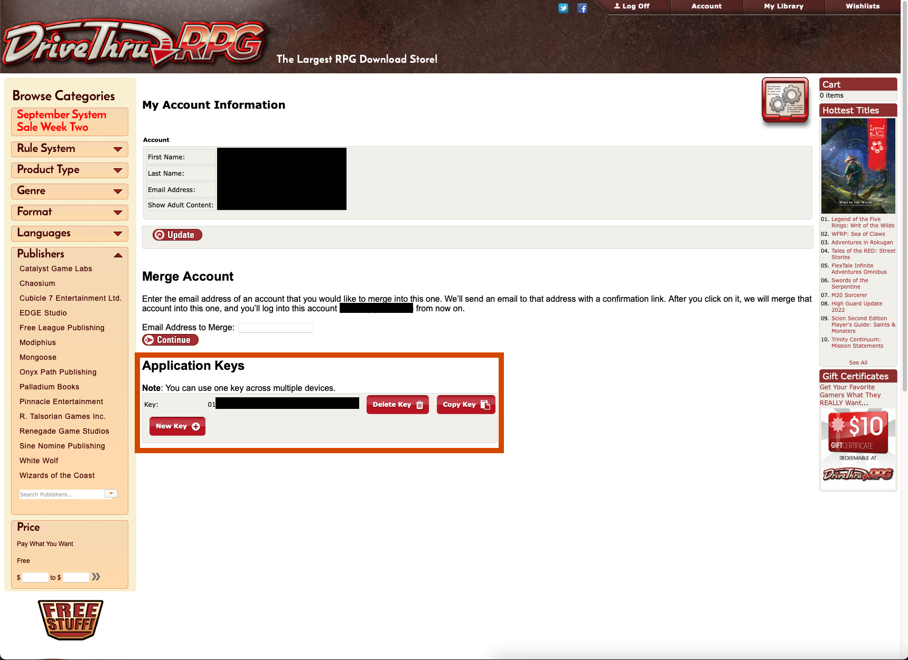

# VTT World of Darkness Book Parser
This is a desktop application for Windows, macOS and Linux which downloads certain books
from [DriveThru RPG](https://www.drivethrurpg.com/index.php), extracts a subset of the text and
images from the PDF, and converts that into a [Foundry VTT](https://foundryvtt.com) module.

## Supported Books
You **must** own the book on DriveThru RPG - using a local copy of the PDF is not supported.

Currently only [Werewolf: the Apocalypse 20th Anniversary Edition](https://www.drivethrurpg.com/product/112871/Werewolf-The-Apocalypse-20th-Anniversary-Edition?term=Werewolf+the+apocalypse+20) is supported.

## Content Generated
All content should be correctly de-hyphenated but if you notice any issues please let me know.

### Werewolf 20th
The following content is currently extracted from the PDF:

* Gifts (all tribes, except for Boli Zousizhe, Kucha Ekundu, Hakken, Siberakh, and Gifts of the Outsiders);
  Includes description + system, and gifts _should_ have the correct roll set, if applicable.
* Breed descriptions
* Auspice descriptions
* Tribe descriptions
* Backgrounds, including full description (partial)
* Melee Weapons

Things I would like to do (in rough priority order):

* Rites
* Fetishes
* Remaining items like ranged weapons and armor
* Spirit Charms
* Sample NPCs (e.g., Banes, Elementals, Weaver Spirits, etc)
* Merits & Flaws
* Totems
* Fomori powers
* Nature & Demeanor
* Tribal Camps
* Anything else that could be useful

## Getting started
Download the [latest release](https://github.com/ipsi/vtt-wod-book-parser/releases) for your operating system:

* macOS
* Linux
* Windows - note that two files are provided, one is an MSI installer, the other is the plain
  exe file.

When you run the application you will see a screen that looks like this (macOS version show):

### DTRPG Application Key

You will need to select a book and enter your DTRPG Application Key (this is similar to a
username and password, but you can delete it when you're finished with it without having
to change your password). If you don't already have one, click on the link, and it should open
up the [DTRPG Account Page](https://www.drivethrurpg.com/account_edit.php). This page looks
like this:

In the highlighted section, you'll see a header for "Application Keys" - if you don't see an
existing one there, click "New Key" to create one, and then "Copy Key" to copy it.

### Foundry Directory
This will default to the [standard Foundry install location](https://foundryvtt.com/article/configuration/),
and will automatically create a module inside it. If you want to place the module in a different
directory, click the button next to the text box.

## Generating the Module
Once you've selected a book and entered your key, hit the "Generate Foundry Module" button and
wait. It needs to download the PDF, so depending on your internet speed this might take a
few minutes.

When you see the message `Module "wod-werewolf-20-core" generated at ...` in the large text box in the center, then it's done.

If you see any lines that don't look like `16:53:03.861 [main] INFO name.ipsi.project.fwbp.BookProcessor - `,
then it's likely an error occurred.